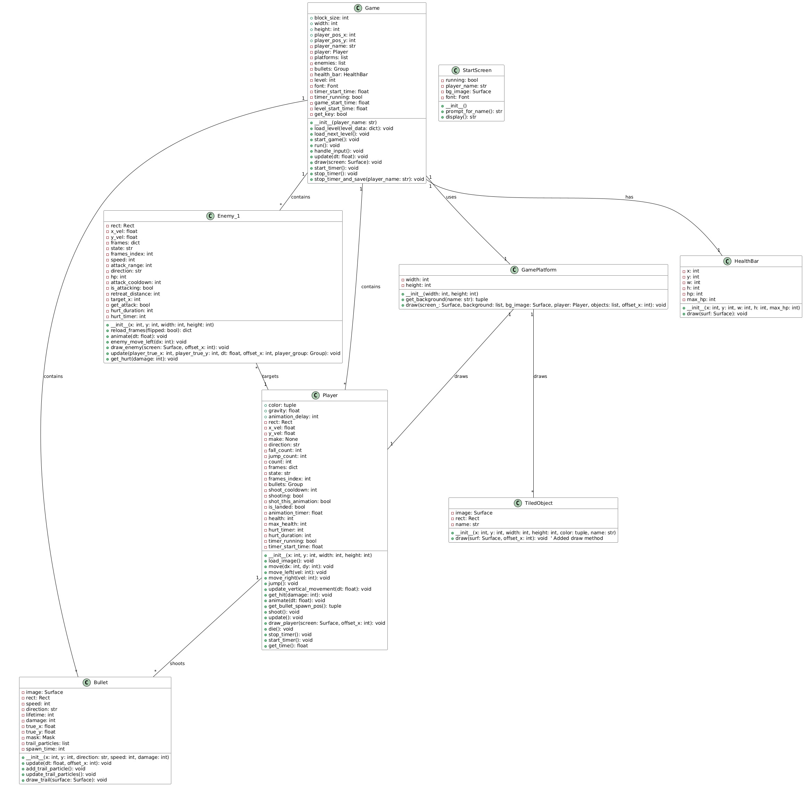

# Palace Game - 2D Action Platformer

[](placeholder_demo_video.mp4)

**Palace Game** is a dynamic 2D action platformer developed using Python and the Pygame library. This project delivers
classic platforming gameplay with an emphasis on action elements, including player combat and engaging level design.

## ♥︎ Overview and Concept

Palace Game combines traditional platforming mechanics with action-oriented gameplay. Players control a character who navigates through levels, overcoming obstacles and battling enemies. The core gameplay loop involves:

* **Platforming:** Players traverse levels with jumps, movement, and interaction with platforms and the environment.
* **Combat:** Players engage enemies using projectile attacks (bullets), requiring aiming and timing.
* **Level Progression:** Players advance through levels, facing increasing difficulty and challenges.

The concept revolves around creating an engaging and challenging experience within the 2D platformer genre, with a focus on fluid player movement and satisfying combat.

## 📜 UML Class Diagram



---

## 🔑 Key Features

* **Dynamic Player Movement:** The Player class handles movement, including running, jumping, and potentially other actions.
* **Enemy Encounters:** The Enemy_1 class defines enemy behavior and combat.
* **Projectile Combat:** The Bullet class enables players to shoot projectiles.
* **Scrolling Levels:** The GamePlatform class manages the game environment and scrolling.
* **Health Management:** The HealthBar class displays the player's health.
* **Level Loading:** The Game class is responsible for loading level data.
* **Start Screen:** The StartScreen class provides an initial menu and player name input.
* **Game Data Analysis:** The make_graph.py script analyzes game data (if available) and generates visualizations.

---

## 📡 Core Technologies

* Python 3.x (Specific version recommended: Check your development environment)
* Pygame (Version: Check your development environment, but likely a recent version)

---

## 🖥️ Installation

1.  Ensure Python 3.x is installed on your system.
2.  Install the required Pygame package:

    ```bash
    pip install pygame
    ```

---

## 🧑‍💻 Running the Game

1.  Navigate to the project directory in your terminal.
2.  Execute the main script:

    ```bash
    python main.py
    ```

---

## 📂 Project Structure

```bash
palace_game/
├── bullet.py          # Defines the Bullet class for projectiles.
├── enemy.py           # Defines the Enemy_1 class for enemy characters.
├── game_platform.py   # Defines the GamePlatform class for handling the game environment.
├── game.py            # Contains the main Game class, managing game state and logic.
├── health.py          # Defines the HealthBar class for displaying player health.
├── main.py            # The primary script to launch the Palace Game.
├── make_graph.py      # A utility script for analyzing game data and generating visualizations.
├── player.py          # Defines the Player class, handling player movement and actions.
├── start_screen.py    # Defines the StartScreen class for the initial game menu.
└── data_record.csv?   # (Optional) Data file for analysis (if implemented)
```
Developed By
Patthiaon Panitanont 6710545792
---
MIT License

Copyright (c) 2025 Patthiaon Panitanont

Permission is hereby granted, free of charge, to any person obtaining a copy
of this software and associated documentation files (the "Software"), to deal
in the Software without restriction, including without limitation the rights
to use, copy, modify, merge, publish, distribute, sublicense, and/or sell
copies of the Software, and to permit persons to whom the Software is
furnished to do so, subject to the following conditions:

The above copyright notice and this permission notice shall be included in all
copies or substantial portions of the Software.

THE SOFTWARE IS PROVIDED "AS IS", WITHOUT WARRANTY OF ANY KIND, EXPRESS OR
IMPLIED, INCLUDING BUT NOT LIMITED TO THE WARRANTIES OF MERCHANTABILITY,
FITNESS FOR A PARTICULAR PURPOSE AND NONINFRINGEMENT. IN NO EVENT SHALL THE
AUTHORS OR COPYRIGHT HOLDERS BE LIABLE FOR ANY CLAIM, DAMAGES OR OTHER
LIABILITY, WHETHER IN AN ACTION OF CONTRACT, TORT OR OTHERWISE, ARISING FROM,
OUT OF OR IN CONNECTION WITH THE SOFTWARE OR THE USE OR OTHER DEALINGS IN THE
SOFTWARE.
